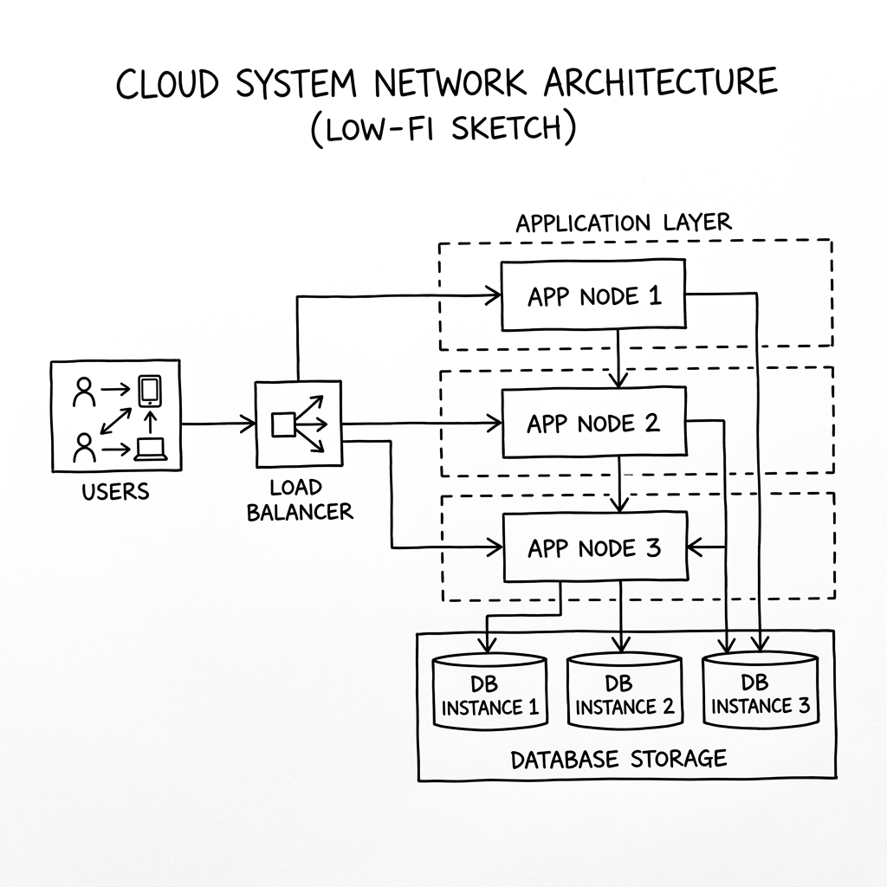
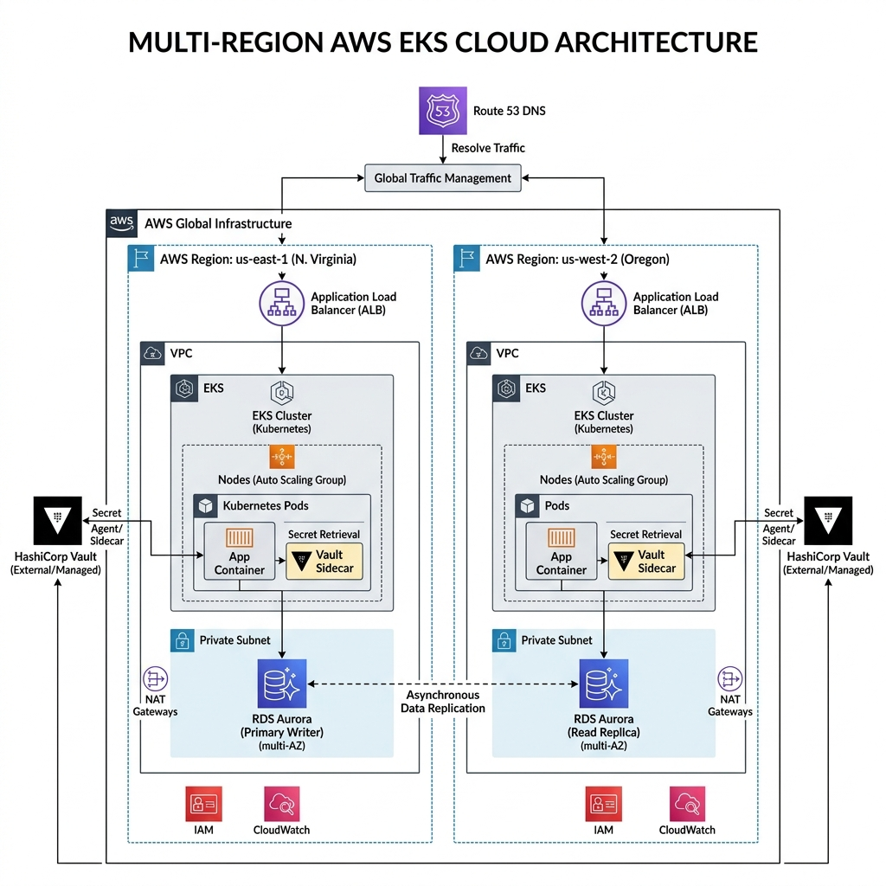
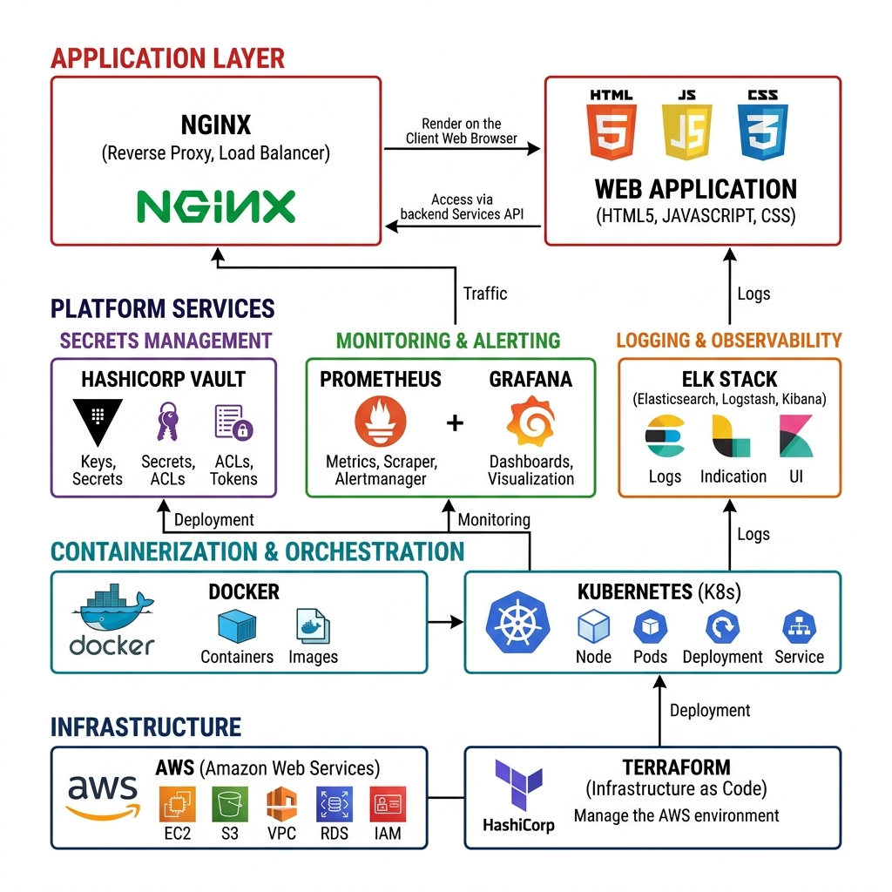

# Academic Project Profile

| Field | Details |
| :--- | :--- |
| **Student Name** | Sourabh Dinesh Yadav |
| **Roll Number** | 150096724013 |
| **Cohort** | MZ |
| **Academic Batch** | 2024-28 |

---

# Project QuantumLedger — Technical Architecture & Operations Manual
**Global Central Bank Digital Currency (CBDC) Operations Platform**

---

## 1. Executive Overview

### 1.1 What is QuantumLedger?
**QuantumLedger** is a highly resilient, enterprise-scale Central Bank Digital Currency (CBDC) DevOps ecosystem and transactional platform. It provides the technological foundation for central banks, commercial institutions, retail merchants, and citizens to execute digital currency issuance, settlement, identity verification, and cross-border payments. The platform is designed for near-zero downtime and strict compliance under regulatory scrutiny.

### 1.2 QuantumLedger in Simple Terms
Imagine a digital replacement for physical cash that is issued directly by a nation's central bank. Instead of paper money traveling in wallets, digital money travels securely over a blockchain-inspired network of computers.
* **QuantumLedger** is the system of engines, pipes, and security guards that makes this network run.
* It ensures that even if a whole cloud data center goes offline (like in a storm), the money doesn't disappear, and citizens can keep buying goods without delay.
* It uses automated "security guards" (Vault) to change passwords every hour so hackers can't steal keys, and "monitoring sensors" (Prometheus/Grafana) to warn operators if traffic spikes.

---

## 2. Problem Statement & Proposed Solution

### 2.1 The Problem Statement
Existing retail and commercial payment networks are highly fragmented across jurisdictions. During stress events (such as financial panics, cyberattacks, or cloud infrastructure outages), central banking authorities suffer from:
1. **Settlement Delays**: Slow ledger processing under peak transactional surges.
2. **Synchronization Failures**: Distributed ledgers diverging due to network partitions.
3. **Security Vulnerabilities**: Compromised credentials allowing unauthorized database or API access.
4. **Slow Disaster Recovery**: Inability to recover operations within strict regulatory timeframes (RTO < 5s).

### 2.2 Proposed Solution
The modernized QuantumLedger platform implements a cloud-native DevOps ecosystem:
* **Infrastructure as Code (Terraform)**: Rapid, consistent multi-region cloud provisioning.
* **Containerization & Orchestration (Docker & Kubernetes)**: Isolated services that scale dynamically via Horizontal Pod Autoscalers (HPA).
* **Automated CI/CD (Jenkins)**: Declarative delivery pipelines with integrated security scanning.
* **Security & Secret Management (HashiCorp Vault)**: Dynamic credentials lease and TLS certificate injection.
* **Observability (Prometheus, Grafana, ELK)**: Real-time alerting and tamper-proof log aggregation.

---

## 3. System Architecture

The QuantumLedger infrastructure is partitioned into regional EKS clusters connected via high-speed database replication channels and DNS global failover endpoints.

### 3.1 Overview
The architectural design emphasizes high availability, zero transaction loss, and regulatory observability. Below are the design specifications:

### 3.2 Low-Fidelity Architecture Sketch
This wireframe illustrates the simplified routing path of transactional request flows from user devices through the load balancer to the application gateway replicas and database instances:



---

### 3.3 High-Fidelity Enterprise Architecture Diagram
This diagram presents the full enterprise-scale deployment topology, illustrating multi-region active-standby redundancy across AWS zones:



---

## 4. Web Application Architecture

### 4.1 User Experience Flow
The QuantumLedger web application implements a two-stage interaction flow:

1. **Landing Page** — A public-facing page introducing the platform's capabilities (CBDC Transaction Settlement, Automated Self-Healing, DevSecOps Compliance) with a prominent "Enter Operations Dashboard" call-to-action button.
2. **Detailed Operations Dashboard** — A multi-view operations center with a persistent sidebar navigation providing access to five specialized views.

### 4.2 Dashboard Views & Sidebar Navigation

The dashboard uses a left sidebar with Lucide SVG vector icons for navigation between five operational views:

| View | Sidebar Icon | Description |
|---|---|---|
| **System Overview** | `bar-chart-2` | Live throughput (TPS), latency, pod count, error rate stats. Infrastructure health status (EKS, Route53, RDS Aurora, Vault). Operations incident monitor table. |
| **Stress Simulators** | `terminal` | Interactive stress test cards: Transaction Surge (HPA scale-out), Region Outage (DR failover), Jenkins CI/CD Pipeline (6-stage build visualization), and Kubernetes Pod Grid (real-time autoscaling). |
| **Consensus & Network** | `git-branch` | Interactive SVG topology map of ledger consensus nodes (Core Ledger, DR Replica, Chase, Citi, HSBC, Retail API). Live consensus state: block height, agreement %, validators, sync progress, and voting log stream. Ledger Desync simulator. |
| **Live Telemetry** | `activity` | Real-time Chart.js streaming graphs (TPS, CPU Load, Latency). Telemetry dials for CPU, Memory, Queue, and Consensus Delay. ELK Central Log Analyzer stream. |
| **Vault & Security** | `shield` | Cyber Attack simulator with Vault Key Rotation. Credential Audit Dashboard (active leases, token TTL, WAF blocks). SOC2 & ISO 27001 Compliance Health Index gauge. |

### 4.3 Icon System
All user interface icons use the **Lucide** open-source SVG icon pack, loaded from the jsDelivr CDN (`https://cdn.jsdelivr.net/npm/lucide@latest/dist/umd/lucide.min.js`). No emoji characters are used anywhere in the application. Icons are declared as `<i data-lucide="icon-name">` HTML attributes and rendered at runtime by `lucide.createIcons()`.

### 4.4 Typography & Design System
* **Primary Font**: Inter (400, 500, 600, 700 weights) — Google Fonts
* **Monospace Font**: JetBrains Mono (400, 500, 700 weights) — used for metrics, logs, and data values
* **Design Language**: Dark-themed glassmorphic cards with color-coded feature areas (Hot Pink, Deep Teal, Ochre, Cream, Peach)
* **Charts**: Chart.js library for real-time line graphs with dual Y-axes

---

## 5. Interactive Simulator Scenarios

The dashboard includes five stress test simulators that demonstrate infrastructure resilience:

### 5.1 Transaction Surge
* **Location**: Stress Simulators view → Stress Test 01
* **Behavior**: Simulates 12,000 TPS load. CPU spikes, latency increases. HPA scales API Gateway pods from 3 to 12 replicas. Recovery auto-stabilizes CPU to 45% and latency to 30ms.

### 5.2 Region Outage & Disaster Recovery
* **Location**: Stress Simulators view → Stress Test 02
* **Behavior**: Simulates us-east-1 failure. Primary ledger node goes offline, error rate climbs to 100%. Within 3.5 seconds, Route53 shifts DNS to us-west-2 DR replica. Full recovery demonstrated.

### 5.3 Ledger Desynchronization
* **Location**: Consensus & Network view → Simulate Consensus Desync
* **Behavior**: Simulates network partition between Chase settlement gateway and core ledger. Chase node shows "Index Lag" status. Raft consensus reconciliation catches up and recovers.

### 5.4 Cyber Attack & Vault Key Rotation
* **Location**: Vault & Security view → Simulate Attack + Rotate Vault Keys
* **Behavior**: Simulates compromised credentials attacking retail POS endpoint. Vault rejects requests and logs authorization failures. Key rotation generates new PostgreSQL credentials via dynamic lease.

### 5.5 Jenkins CI/CD Pipeline
* **Location**: Stress Simulators view → DevOps Delivery card
* **Behavior**: Simulates 6-stage Jenkins pipeline: Checkout → Lint & Test → Build → Scan (Trivy) → TF Apply → Deploy (Rolling K8s update). Each stage visualized with progress dots and log output.

---

## 6. Technology Stack

QuantumLedger integrates production-grade open source tools and AWS services. The diagram below illustrates the technology architecture layer integration:



### 6.1 Component Breakdown
* **Infrastructure**: AWS (EC2, VPC, EKS, RDS Aurora Global Database, KMS, Route 53), provisioned via **Terraform**.
* **Containerization**: **Docker** for local stacks and multi-stage packaging; **Kubernetes** StatefulSets and Deployments for EKS workloads orchestration.
* **Secrets Management**: **HashiCorp Vault** using AppRole auth, dynamic PostgreSQL engines, PKI certificate generation, and KMS auto-unseal.
* **Monitoring & Alerting**: **Prometheus** metrics scraping and alert rule definitions; **Grafana** visualization dashboards.
* **Logging & Observability**: **ELK Stack** (Elasticsearch, Logstash parsing filters, Filebeat).
* **Application Delivery**: **Nginx** reverse proxies and static file servers hosting a responsive **Vanilla CSS & HTML5** operations dashboard.
* **Icon System**: **Lucide** open-source SVG icon library (CDN-hosted).
* **Charts & Visualization**: **Chart.js** for real-time telemetry graphs.
* **Typography**: **Google Fonts** (Inter, JetBrains Mono).

---

## 7. DevOps Infrastructure Configuration

### 7.1 Docker Configuration
The project includes a production-ready Docker setup:

* **Dockerfile** (`docker/Dockerfile`): Multi-step Alpine Nginx image that copies the dashboard static assets (`index.html`, `app.css`, `app.js`, `claymation_hero.png`) into the Nginx web root and applies a security-hardened Nginx configuration.
* **docker-compose.yml** (`docker/docker-compose.yml`): Orchestrates four services:
  - `dashboard` (Nginx on port 80) — The CBDC Operations Dashboard
  - `prometheus` (port 9090) — Metrics scraping and alerting
  - `grafana` (port 3000) — Dashboard visualization
  - `vault` (port 8200) — HashiCorp Vault in dev mode with `quantum-root-token`
* **Restart Policy**: All containers use `restart: unless-stopped` for automatic recovery on reboot.

### 7.2 Nginx Security Configuration
The Nginx configuration (`docker/nginx.conf`) enforces production-grade security headers:
* `X-Frame-Options: DENY` — Prevents clickjacking
* `X-Content-Type-Options: nosniff` — Prevents MIME sniffing
* `Content-Security-Policy` — Restricts script/style sources to self and trusted CDNs (jsDelivr, Google Fonts)
* `Referrer-Policy: strict-origin-when-cross-origin`
* `Permissions-Policy` — Disables geolocation, microphone, camera
* **Gzip compression** enabled for text assets
* **Cache policy**: Static assets cached for 1 year with `Cache-Control: public`

### 7.3 Deployment Automation (`deploy.sh`)
An automated deployment script handles end-to-end EC2 provisioning:
1. Tests SSH connectivity to the EC2 instance (with ubuntu/ec2-user fallback)
2. Syncs repository files via `rsync` (excluding `.git`, `node_modules`, `.pem` files)
3. Installs Docker and Docker Compose on EC2 if not present
4. Stops and disables host-level Nginx to free port 80
5. Enables Docker service to start automatically on system boot
6. Builds and launches the Docker Compose stack

### 7.4 Terraform Infrastructure
Modular Terraform configurations in `terraform/` provision:
* AWS EC2 instances with security groups
* VPC and networking (private/public subnets)
* EKS cluster definitions
* KMS encryption keys
* Aurora Global Database clusters

### 7.5 Kubernetes Manifests
Production-grade Kubernetes manifests in `kubernetes/`:
* `api-gateway.yaml` — API Gateway Deployment with HPA
* `central-bank-node.yaml` — Core Ledger StatefulSet
* `commercial-bank-node.yaml` — Chase, Citi, HSBC gateway Deployments
* `vault-agent.yaml` — Vault Agent sidecar injection configuration
* `monitoring/` — Prometheus configuration, alerting rules, Logstash filters, Grafana dashboards

### 7.6 Jenkins CI/CD Pipeline
The `jenkins/Jenkinsfile` defines a declarative pipeline with stages:
1. **Checkout** — Git repository clone
2. **Lint & Test** — Code quality and unit test execution
3. **Docker Build** — Multi-stage container image creation
4. **Security Scan** — Trivy vulnerability scanning
5. **Terraform Apply** — Infrastructure provisioning validation
6. **Rolling Deploy** — Kubernetes rolling update execution

---

## 8. AWS EC2 Production Deployment

### 8.1 Live Deployment Details
The static operations platform is deployed on an AWS EC2 instance running Docker:
* **Public IP Address**: `http://3.84.104.8`
* **Runtime**: Docker container running Nginx Alpine
* **Port Mapping**: Container port 80 → Host port 80
* **Auto-Recovery**: Docker service enabled on boot; containers configured with `restart: unless-stopped`
* **Access Guide**: Connect via standard web browser to `http://3.84.104.8` to view the live platform.

### 8.2 Source Code Repository
The complete source code is hosted on GitHub:
* **Repository**: `https://github.com/YadavSourabhGH/QuantumLedger---Devops`
* **Branch**: `main`
* **Deployment Workflow**: Push to `main` → SSH into EC2 → `git pull` → Rebuild Docker containers

---

## 9. Repository File Structure

```
QuantumLedger/
├── index.html                    # Main HTML (Landing Page + Dashboard)
├── app.css                       # Complete stylesheet (39 KB)
├── app.js                        # Dashboard controller logic (40 KB)
├── claymation_hero.png           # 3D hero illustration
├── claymation_footer.png         # Footer illustration asset
├── deploy.sh                     # Automated EC2 deployment script
├── QuantumLedger.pem             # SSH key for EC2 access
├── QuantumLedger_Documentation.md # This documentation file
├── QuantumLedger_Documentation.pdf # PDF export of documentation
├── README.md                     # Repository README
├── .gitignore                    # Git ignore rules
│
├── docker/
│   ├── Dockerfile                # Nginx Alpine production image
│   ├── docker-compose.yml        # Multi-service stack orchestration
│   └── nginx.conf                # Security-hardened Nginx config
│
├── terraform/
│   ├── main.tf                   # Core AWS infrastructure
│   ├── variables.tf              # Parameterized input variables
│   ├── outputs.tf                # Infrastructure output values
│   └── modules/                  # Reusable Terraform modules
│
├── kubernetes/
│   ├── api-gateway.yaml          # API Gateway Deployment + HPA
│   ├── central-bank-node.yaml    # Core Ledger StatefulSet
│   ├── commercial-bank-node.yaml # Bank gateway Deployments
│   ├── vault-agent.yaml          # Vault sidecar injection
│   └── monitoring/               # Prometheus, Grafana, Logstash configs
│
├── jenkins/
│   └── Jenkinsfile               # Declarative CI/CD pipeline
│
├── docs/
│   ├── architecture_diagram.md   # Mermaid infrastructure topology
│   ├── deployment_diagram.md     # K8s pod & service layout
│   ├── compliance_controls.md    # SOC2/PCI-DSS/ISO 27001 controls
│   └── disaster_recovery_plan.md # DR runbook & failover procedures
│
└── *.png                         # Architecture diagram images
```
