# QuantumLedger - Global CBDC Infrastructure Architecture

This document presents the high-level infrastructure design of the QuantumLedger platform. The system is deployed across two geographical AWS regions to satisfy strict regulatory compliance, low latency, and disaster recovery objectives (RTO < 5s, RPO ≈ 0).

## Infrastructure Topology Diagram

The diagram below outlines the Route 53 DNS routing, application load balancers, EKS clusters (with integrated HashiCorp Vault instances), and the Aurora Global Database replication.

```mermaid
graph TD
    %% Users & Routing
    Users[Global Citizens & Commercial Banks] -->|https://cbdc.ledger.internal| R53[Route 53 Global Traffic Manager]

    %% Active Region (us-east-1)
    R53 -->|Active Traffic 100%| ALB_Primary[Application Load Balancer us-east-1]
    
    subgraph Region_Primary [AWS Region us-east-1 - PRIMARY]
        ALB_Primary -->|HTTP Ingress| EKS_Primary[Amazon EKS Cluster - us-east-1]
        
        subgraph VPC_Primary [VPC us-east-1 - 10.0.0.0/16]
            subgraph Private_Subnets_Pri [Private Subnets - EKS Node Groups]
                EKS_Primary --> Pods_API_Pri[API Gateway Pods]
                EKS_Primary --> Pods_Ledger_Pri[Core Ledger StatefulSet]
                EKS_Primary --> Vault_Pri[HashiCorp Vault Service]
            end
            
            subgraph Database_Subnets_Pri [Database Subnets]
                Aurora_Writer[(Aurora PG Global DB: WRITER)]
            end
        end
        
        Pods_API_Pri -->|gRPC/mTLS| Pods_Ledger_Pri
        Pods_API_Pri -->|Vault Dynamic Agent| Vault_Pri
        Pods_Ledger_Pri -->|SQL Connection| Aurora_Writer
        Vault_Pri -->|Auto-Unseal| KMS_Pri[AWS KMS Key us-east-1]
    end

    %% Standby Region (us-west-2)
    R53 -.->|Failover Traffic 0%| ALB_DR[Application Load Balancer us-west-2]
    
    subgraph Region_DR [AWS Region us-west-2 - STANDBY / DR]
        ALB_DR -->|Standby Ingress| EKS_DR[Amazon EKS Cluster - us-west-2]
        
        subgraph VPC_DR [VPC us-west-2 - 10.1.0.0/16]
            subgraph Private_Subnets_DR [Private Subnets - EKS Node Groups]
                EKS_DR --> Pods_API_DR[API Gateway Pods - STANDBY]
                EKS_DR --> Pods_Ledger_DR[Core Ledger StatefulSet - STANDBY]
                EKS_DR --> Vault_DR[HashiCorp Vault Service - STANDBY]
            end
            
            subgraph Database_Subnets_DR [Database Subnets]
                Aurora_Reader[(Aurora PG Global DB: READ REPLICA)]
            end
        end
        
        Pods_API_DR -->|gRPC/mTLS| Pods_Ledger_DR
        Pods_API_DR -->|Vault Dynamic Agent| Vault_DR
        Pods_Ledger_DR -->|SQL Connection| Aurora_Reader
        Vault_DR -->|Auto-Unseal| KMS_DR[AWS KMS Key us-west-2]
    end

    %% Data Replication & Failover Sync
    Aurora_Writer ===>|High-Speed Physical Replication| Aurora_Reader
    Vault_Pri -.->|Encrypted Sync| Vault_DR
    
    %% Styles
    style Region_Primary fill:#0d111d,stroke:#00f0ff,stroke-width:2px;
    style Region_DR fill:#0d111d,stroke:#a855f7,stroke-width:2px,stroke-dasharray: 5 5;
    style R53 fill:#1e293b,stroke:#f59e0b,stroke-width:2px;
    style Aurora_Writer fill:#166534,stroke:#22c55e,stroke-width:2px;
    style Aurora_Reader fill:#7f1d1d,stroke:#ef4444,stroke-width:2px;
```

## Resilience and DR Strategy
- **DNS Failover**: Route 53 utilizes health checks probing the `/healthz` endpoints of the EKS ingress in `us-east-1`. If timeouts occur, DNS routing shifts automatically to `us-west-2`.
- **Database Replication**: Aurora Global Database replicates blocks asynchronously with latency under 1 second. In the event of a failover, the `us-west-2` cluster is promoted to the writer cluster via Terraform/AWS CLI scripts.
- **Secrets High-Availability**: Vault cluster state is replicated between regions. Should the primary Vault become unreachable, the secondary cluster starts servicing API gateway authentication.
