# QuantumLedger - Kubernetes Pod & Service Deployment Topology

This document describes the logical organization of namespaces, pods, services, and sidecar injectors inside the QuantumLedger EKS clusters.

## Kubernetes Deployment Layout

The diagram below details the ingress routing through the Kubernetes Ingress Controller, pod service limits, and Vault Agent integrations.

```mermaid
graph TD
    %% Ingress & Gateway
    Ingress[AWS alb-ingress-controller] -->|Route: /api/*| Service_API[api-gateway ClusterIP Service]
    Ingress -->|Route: /settle| Service_Chase[chase-gateway ClusterIP Service]

    %% Namespaces
    subgraph K8S_Namespace_Default [Namespace: default]
        
        %% API Gateway Deployment
        subgraph Deployment_API [Deployment: api-gateway]
            Pods_API[api-gateway Pods]
            subgraph Pod_API_Container [Pod Details]
                Container_API[App Container: Node/Go API]
                Sidecar_Vault[Sidecar Container: Vault Agent]
                Shared_Volume[Shared Volume: /vault/secrets]
            end
        end

        %% StatefulSet Core Ledger
        subgraph StatefulSet_Ledger [StatefulSet: cbdc-ledger]
            Pods_Ledger_0[cbdc-ledger-0]
            Pods_Ledger_1[cbdc-ledger-1]
            Pods_Ledger_2[cbdc-ledger-2]
            PV_Ledger[Persistent Volumes - gp3]
        end

        %% Commercial Bank Gateways
        subgraph Deployment_Chase [Deployment: chase-gateway]
            Pod_Chase[chase-gateway Pod]
        end
        subgraph Deployment_Citi [Deployment: citi-gateway]
            Pod_Citi[citi-gateway Pod]
        end
    end

    subgraph K8S_Namespace_Security [Namespace: security]
        Service_Vault[vault ClusterIP Service]
        Vault_Cluster[Vault StatefulSet Pods]
    end

    subgraph K8S_Namespace_Monitoring [Namespace: monitoring]
        Prometheus_Pod[Prometheus server]
        Grafana_Pod[Grafana Dashboard]
    end

    %% Network Connections & Injection
    Service_API --> Pods_API
    Service_Chase --> Pod_Chase
    
    %% Connections inside Default namespace
    Container_API -->|Read Db Credentials| Shared_Volume
    Sidecar_Vault -->|Inject dynamic leases| Shared_Volume
    Sidecar_Vault -->|Auth & Retrieve Keys| Service_Vault
    
    Container_API -->|gRPC Consensus request| Pods_Ledger_0
    Pod_Chase -->|Validate transaction batch| Pods_Ledger_0
    
    Pods_Ledger_0 ===|Consensus Sync via Headless| Pods_Ledger_1
    Pods_Ledger_0 ===|Consensus Sync via Headless| Pods_Ledger_2
    
    Pods_Ledger_0 -->|Write Ledger State| PV_Ledger

    %% Monitoring Scraping
    Prometheus_Pod -->|Scrape /metrics| Pods_API
    Prometheus_Pod -->|Scrape /metrics| Pods_Ledger_0
    Prometheus_Pod -->|Scrape v1/sys/metrics| Service_Vault
    Grafana_Pod -->|Query metrics| Prometheus_Pod

    %% Styles
    style K8S_Namespace_Default fill:#0f172a,stroke:#0284c7,stroke-width:2px;
    style K8S_Namespace_Security fill:#1e1b4b,stroke:#818cf8,stroke-width:2px;
    style K8S_Namespace_Monitoring fill:#180f2a,stroke:#c084fc,stroke-width:2px;
    style Pod_API_Container fill:#1e293b,stroke:#0f172a;
```

## Pod Security Standards
- **Non-Root Execution**: All application container workloads explicitly declare `securityContext.runAsNonRoot: true` and execute under UID `10001`.
- **Read-Only Root Filesystem**: Core container filesystems are mounted read-only (`readOnlyRootFilesystem: true`), except for `/tmp` and `/vault/secrets` which are mounted as memory-backed `emptyDir` volumes.
- **Resource Constraints**: Strict limits are configured to mitigate Denials of Service (CPU/Memory resource quotas enforced).
